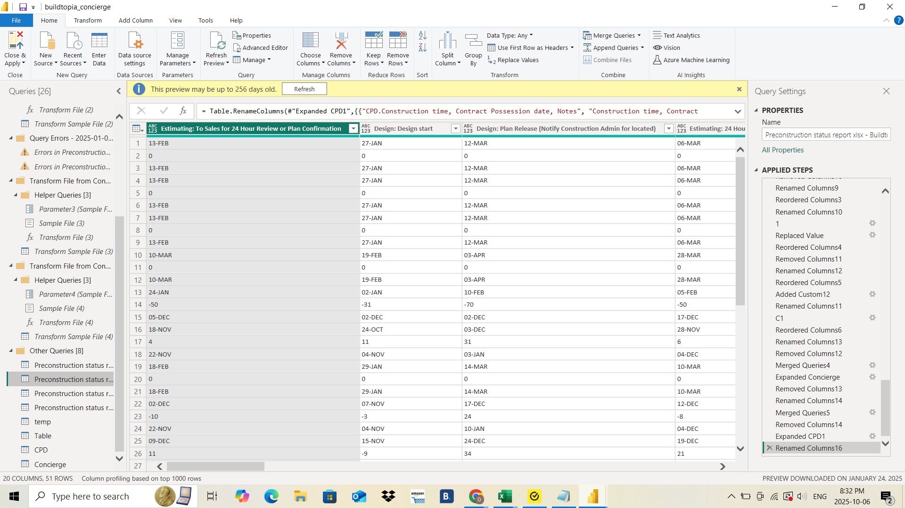
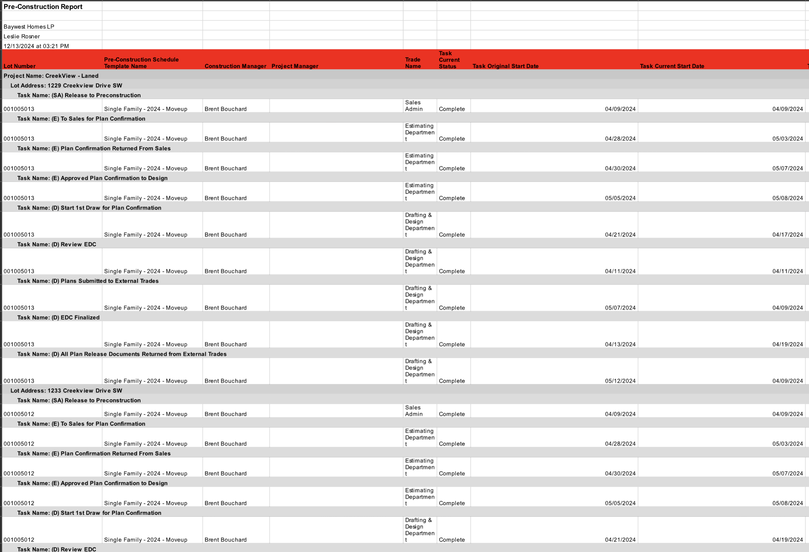
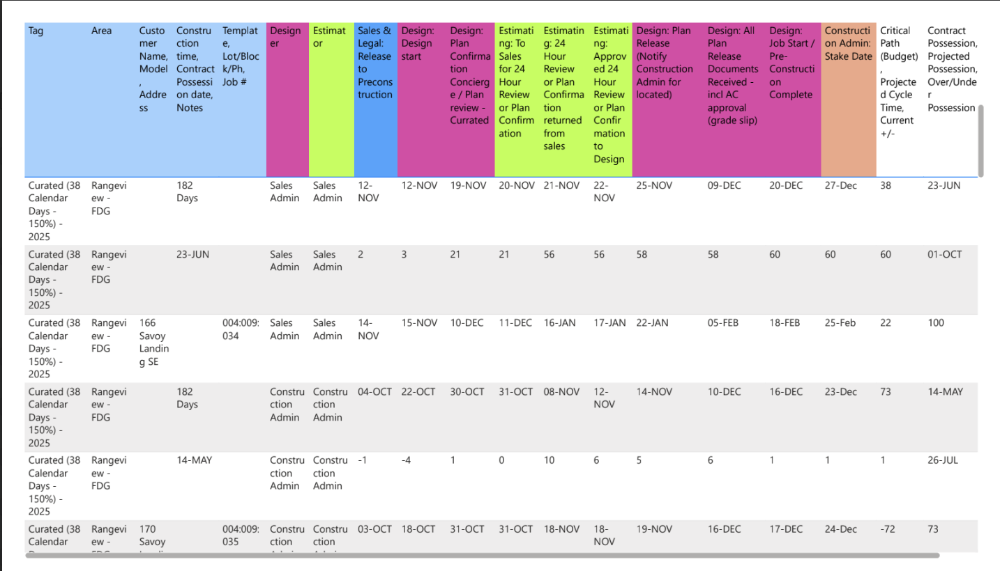

# Construction Project Analytics Automation

A comprehensive data transformation and automation solution that converts complex construction project data from Excel into organized Power BI analytics with automated daily updates.

## Project Overview

This project automates the entire data pipeline for construction project management analytics, transforming messy, unstructured Excel data into clean, actionable insights accessible through SharePoint with daily automatic refreshes.

### Business Problem
- Client had complex construction project data scattered across multiple Excel sheets
- Manual data processing was time-consuming and error-prone
- Needed real-time visibility into project timelines, task completion, and critical path analysis
- Required accessible, up-to-date dashboards for stakeholders

### Solution
Built an end-to-end automated analytics pipeline:
1. **Data Extraction**: Power Automate downloads Excel files automatically
2. **Data Transformation**: Complex Power Query transformations clean and structure data
3. **Visualization**: Power BI dashboards provide actionable insights
4. **Distribution**: SharePoint-hosted reports with automatic daily refresh

## Screenshots

### Power BI Query Editor - Data Transformation

*Complex Power Query transformations converting raw Excel data into structured tables*

### Source Excel Data Structure

*Original unstructured Excel format with project timelines across multiple columns*

### Final Report Output

*Clean, organized output ready for stakeholder consumption*

### Source Data Characteristics
- **Multiple project phases**: Pre-construction, Design, Estimating, Sales & Legal, Construction Admin
- **Complex timeline tracking**: Original start dates, current start dates, task completion status
- **Hierarchical relationships**: Projects → Lot Addresses → Tasks → Subtasks
- **Date calculations**: Construction time, possession dates, critical path analysis

### Key Transformations
- Unpivoted construction phase columns into normalized task rows
- Calculated project duration metrics (182 days, 166 days, etc.)
- Extracted and standardized date formats across multiple formats
- Created task status tracking (Complete, In Progress, Pending)
- Built hierarchical project-lot-task relationships

## Technical Architecture

```
Excel Files (OneDrive/SharePoint)
        ↓
Power Automate (Scheduled Download)
        ↓
Power Query M (Data Transformation)
        ↓
Power BI Desktop (Data Model & Visualizations)
        ↓
Power BI Service (Published Reports)
        ↓
SharePoint (Embedded Dashboard)
        ↓
Daily Auto-Refresh
```

## Key Features

### Power Query Transformations
- **Column Unpivoting**: Transformed wide-format construction phases into long-format task records
- **Date Parsing**: Handled multiple date formats (DD-MMM, DD-MON, MM/DD/YYYY)
- **Conditional Columns**: Created task status flags and completion indicators
- **Text Extraction**: Parsed customer names, project types, and addresses
- **Calculated Metrics**: Duration calculations, critical path identification

### Automation Components
- **Power Automate Flow**: Scheduled Excel file downloads
- **Power BI Service**: Dataset refresh scheduling
- **SharePoint Integration**: Embedded live dashboards

## Implementation

### Prerequisites
- Power BI Desktop (latest version)
- Power BI Pro or Premium license (for service features)
- Microsoft 365 subscription (Power Automate, SharePoint)
- Access to source Excel files

### Setup Steps

1. **Configure Power Automate**
   - Create scheduled flow to download Excel files
   - Store files in accessible SharePoint location
   - Set appropriate refresh frequency

2. **Import Power Query Transformations**
   - Open Power BI Desktop
   - Load provided `.pq` files
   - Update source file paths
   - Verify data types and relationships

3. **Build Data Model**
   - Create relationships between tables
   - Define calculated columns and measures
   - Set up date tables for time intelligence

4. **Deploy to Power BI Service**
   - Publish report to workspace
   - Configure dataset refresh schedule
   - Set up data gateway if needed

5. **Embed in SharePoint**
   - Add Power BI web part to SharePoint page
   - Configure permissions
   - Test automatic refresh


## Results

- **Time Saved**: Reduced manual data processing from 4 hours/week to 0
- **Data Accuracy**: Eliminated manual entry errors
- **Accessibility**: 24/7 access to current project status via SharePoint
- **Decision Speed**: Real-time visibility enables faster project decisions

## Contributing

This project was built for a specific client use case but demonstrates reusable patterns for:
- Complex Excel-to-Power BI transformations
- Power Automate integration
- SharePoint dashboard deployment
- Construction project analytics

## License

This project documentation is provided as-is for educational and reference purposes.

## Author

**Justin Milner**
- Project Manager & Developer

## Tags

`power-bi` `power-query` `power-automate` `data-transformation` `excel-automation` `sharepoint` `construction-analytics` `m-language` `etl` `business-intelligence`

---

**Note**: This repository contains transformation logic and documentation. Actual client data and credentials are not included.
